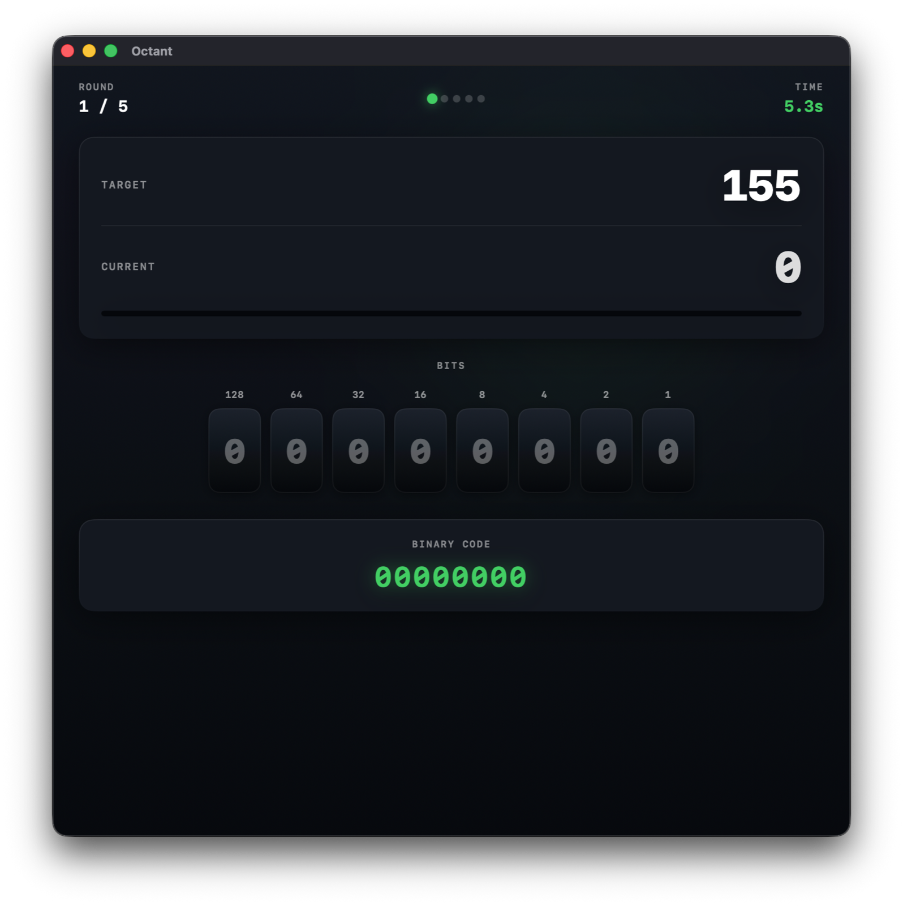

# Octant

**Binary speed trainer for macOS/tvOS.**

[English](#english) · [Français](#français)

---

## English

Octant is a macOS/tvOS port of [**Binary Game**](https://github.com/lapatatedouce59/binary), a browser-based exercise built by [Amaury Crocquefer](https://github.com/lapatatedouce59) ([amaury@crocque.fr](mailto:amaury@crocque.fr)) to help students learn decimal-to-binary conversion. This version is a from-scratch SwiftUI rebuild with a polished UI, EN/FR localization, haptics, and native macOS menu commands.

The name comes from *octant*, the navigator's instrument that measures one-eighth of a circle — a nod to the eight bits in a byte.

### How to play

1. **Set up your run.** Choose how many rounds you want (1–10) and how many bits per round (2–14). The "MAX" value shows the largest target you can be asked to hit.
2. **Hit the target.** Each round gives you a random decimal target. Toggle the bits — each one is worth a power of two — until your sum matches.
3. **Race the clock.** Octant times every round and counts every click. Your averages appear on the results screen, with stars next to your fastest round and your most efficient solve.

### Requirements

- macOS 14 (Sonoma) or later
- Xcode 15 or later (to build from source)

### Build & run

```sh
git clone <this-repo-url>
cd Octant
open Octant.xcodeproj
```

Then press ⌘R in Xcode. Or from the command line:

```sh
xcodebuild -project Octant.xcodeproj -scheme Octant -configuration Release build
```

### Keyboard shortcuts

| Shortcut | Action |
| --- | --- |
| ⌘N | New game (asks for confirmation if a round is in progress) |
| ⌘⇧N | Play again (results screen only) |

### Screenshot

<!-- Drop your screenshot at docs/screenshot.png and it will appear here. -->



### Credits

- **Original game** — [Binary Game](https://github.com/lapatatedouce59/binary) by [Amaury Crocquefer](https://github.com/lapatatedouce59) · [amaury@crocque.fr](mailto:amaury@crocque.fr)
- **macOS/tvOS port** — [Douglas Carmichael](https://github.com/douglas-carmichael) · [dcarmich@dcarmichael.net](mailto:dcarmich@dcarmichael.net)

---

## Français

Octant est un portage macOS et tvOS de [**Binary Game**](https://github.com/lapatatedouce59/binary), un exercice web créé par [Amaury Crocquefer](https://github.com/lapatatedouce59) ([amaury@crocque.fr](mailto:amaury@crocque.fr)) pour aider les étudiants à apprendre la conversion décimal–binaire. Cette version est une réécriture complète en SwiftUI, avec une interface soignée, une localisation EN/FR, du retour haptique et des commandes de menu natives macOS.

Le nom vient de l'*octant*, l'instrument du navigateur qui mesure un huitième de cercle — un clin d'œil aux huit bits d'un octet.

### Comment jouer

1. **Configure ta partie.** Choisis le nombre de manches (1–10) et le nombre de bits par manche (2–14). La valeur « MAX » indique la plus grande cible possible.
2. **Atteins la cible.** Chaque manche affiche une cible décimale aléatoire. Bascule les bits — chacun vaut une puissance de deux — jusqu'à ce que la somme corresponde.
3. **Cours contre la montre.** Octant chronomètre chaque manche et compte chaque clic. Tes moyennes apparaissent à l'écran final, avec une étoile à côté de ta manche la plus rapide et de ta résolution la plus efficace.

### Configuration requise

- macOS 14 (Sonoma) ou plus récent
- Xcode 15 ou plus récent (pour compiler)

### Compilation & exécution

```sh
git clone <url-du-repo>
cd Octant
open Octant.xcodeproj
```

Puis ⌘R dans Xcode. Ou en ligne de commande :

```sh
xcodebuild -project Octant.xcodeproj -scheme Octant -configuration Release build
```

### Raccourcis clavier

| Raccourci | Action |
| --- | --- |
| ⌘N | Nouvelle partie (demande confirmation si une manche est en cours) |
| ⌘⇧N | Rejouer (écran des résultats uniquement) |

### Capture d'écran

<!-- Dépose ta capture à docs/screenshot.png et elle apparaîtra ici. -->


### Crédits

- **Jeu original** — [Binary Game](https://github.com/lapatatedouce59/binary) par [Amaury Crocquefer](https://github.com/lapatatedouce59) · [amaury@crocque.fr](mailto:amaury@crocque.fr)
- **Portage macOS/tvOS** — [Douglas Carmichael](https://github.com/douglas-carmichael) · [dcarmich@dcarmichael.net](mailto:dcarmich@dcarmichael.net)
